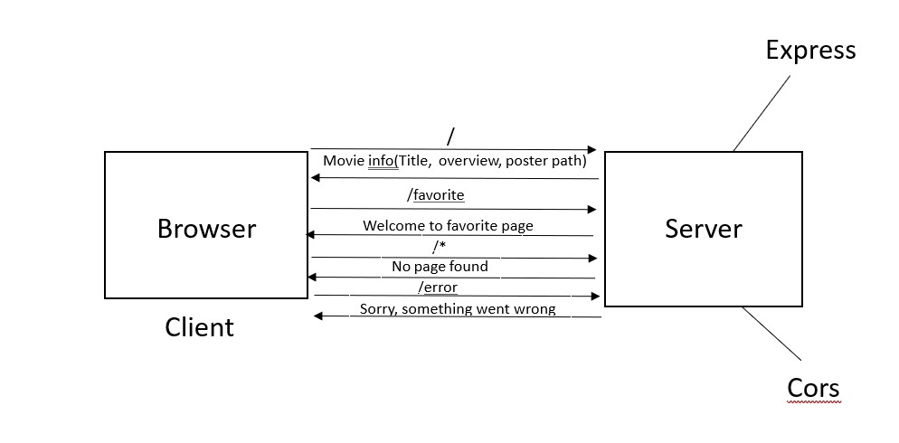

# Movies-Library - 1.0.0

## Reneh Mdanat

## WRRC

## Overview

## Getting Started
i have 11 routes:
- "/" and its response is the movie title,overview and poster path for a static movie we get from data.json file.
- "/favorite" and its response is welcome to favorite page.
- "/trending" and its response is all trending movies from the API.
-"/search" and its response is a specific movie from the API.
-"/people" and its response is all the people list from the API.
-"tv_list" and its response is the tv list from the API.
-/addMovie this route uses the REST method post to add a new movie to our database.
-/getMovies this route uses the REST method get to select all the records from our database.
-/UPDATE/:id this route uses the REST method put to update a specific record using params (id).
-"/DELETE/:id" this route uses the REST method delete to delete a specific record using params (id).
-/getMovie/:id this route uses the REST method get to select a specific record using params (id).
- a 404 middleware and its response is page not found
- a 500 middleware and its response is something went wrong

## Project Features
routes, npm. , API and i connected with a local database using pg library.